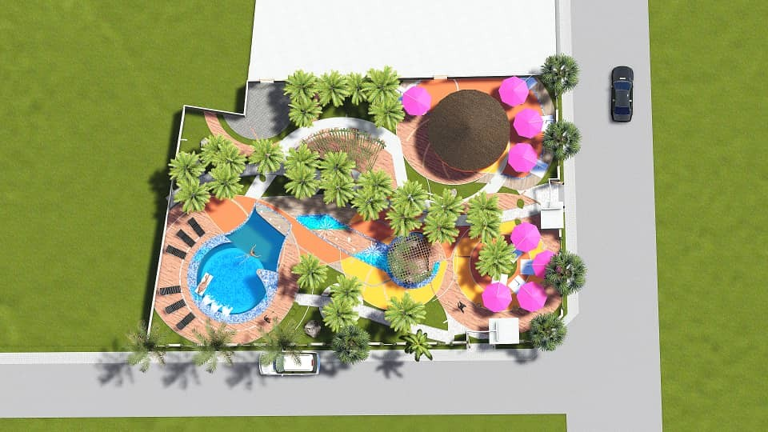

# VICTORIEN DJONTSO

# **Architect & Urban Planner / Developer / BIM & 3D Artist / Digital Art**

- **Address:** 1348, Louvain-la-Neuve
- **Email:** dvrchipro@gmail.com
- **[Website](https://dvgt-dev.github.io/victorien-djontso-cv/) | [Github](https://github.com/DvGt-dev/victorien-djontso-cv/tree/main) | [LinkedIn](https://www.linkedin.com/in/djontso-victorien) | [YouTube](https://www.youtube.com/channel/UCdjontso-victorien2171)**

## PROFILE

Innovative Architect and Developer with a dual expertise in urban planning and 3D technologies. Passionate about leveraging BIM and programming skills to contribute to large-scale projects. Actively seeking opportunities to apply my skills in a challenging environment.

## RECENT HIGHLIGHTS

## PROFESSIONAL REFERENCES

- **NOCA N°414** (National Order of Architects of Cameroon)

## SKILLS

- Versatility, Rigor and precision, Critical thinking, Team spirit
- Complex problem solving, Perseverance in projects, Intellectual curiosity, Autonomous learning
- Artistic Sensibility, Graphic Design, Creativity and innovation
- Proficiency in Excel, Python Programming, Visual Programming (Grasshopper-Houdini), Office Pack

## CERTIFICATES & TRAINING

- **MOOC Sustainable Building** (ADEME-France, 2018)
  - [Building in a humid tropical zone](https://www.mooc-batiment-durable.fr/fr/formations/lumiere-thermique-et-acoustique-bien-construire-en-zone-tropical/)
- **MOOC BIM: Sustainable Building** (ADEME-France, 2018)
  - [Become an actor in the digital transition (But without evaluation)](https://www.mooc-batiment-durable.fr/fr/formations/moocbim-devenez-acteur-de-la-transition-numerique/)

## LANGUAGES

- **French:** Mother tongue
- **English:** Notions

## PROJECTS

- Monument of the Fiftieth Anniversary of the National Unity of Cameroon
- Resort with pool in Kribi

## AREAS OF INTEREST

- Digital/IT Solutions in Architecture and Graphic Art
- Creative 3D Art
- Data management in simulation, visualization and Implementation/Construction.

## PROFESSIONAL PROFILE

- Designing Architectural Plans on **Autocad**, 2D and 3D Plans, **BIM Models Implementation**
- Automatic Publication of Plans, Enhancement of **BIM** information from the model via external sources (Excel, Python, Grasshopper)
- **Autocad** high-fidelity exchange configuration with **Autodesk** (layers, colors, layer filters, layout templates), Revit (BIM model, BIM to be improved)
- Knowledge of the legal basis (Belgian law, BIM and Subuilt Space and then on the Environment); cartographic software, techniques and resources useful to the urban planner (following the current specialization in urban planning).
- Sufficient basis for the use of programming and AI in my work environment and my applications (member of the **GitHub** developer community); use of AI facilitators (**GitHub**-copilot for code, stable diffusion images); Implementation of local text generation for data management and analysis.
- Ambitions: interactive presentations (virtual and augmented reality), real-time simulation, animations (recent experimentation with Unreal Engine and Houdini)

## CAREER

### ACADEMIC INTERN

- **Desisn Construction, Charleroi - Apprenticeship Contract (June 2023 - August 2023)**
  - Created 3D models and presentation images for official meetings with stakeholders (Commune, BELRIS, CCATM).
  - Prepared presentation documents and conducted field visits on construction sites.

### CONSULTANT

- **[ZF Architects](https://www.zf-architects.com/), Yaoundé - Freelance (Mar. 2021 - Sept. 2022)**
  - Led design and architectural follow-up for various projects.
  - Delivered project presentations to clients and stakeholders.

### PROFESSIONAL INTERNSHIP

- **Cabinet Serge Eloundou - SETREC AUI Sarl, Yaoundé - Professionalization Contract (March 2019 - March 2021)**
  - Contributed to large-scale building projects, including a ministry office building, as a programmer, designer, and follow-up architect.

### STAGE STAFF

- **Cabinet Bureau d'Etudes Architectes (BEA), Bafoussam - Professionalization Contract (Aug. 2019 - Dec. 2019)**
  - Assisted the follow-up architect and designer on the construction of the Bafoussam cathedral.

### ACADEMIC INTERN

- **URBATHEC Conseil, Yaoundé - Apprenticeship Contract (July 2016 - Sept. 2016)**
  - Developed architectural designs and created 2D and 3D plans using ArchiCAD.
  - Contributed to the iconic DGI (Direction Générale des Impôts) building project in Yaoundé.
  - Mentored by Herman Kante, an internationally recognized architect featured in Forbes.

## EDUCATION

### SPECIALIZED MASTER'S DEGREE

- **Urbanism and Territorial Planning (URBA2MC)**
  - Université catholique de Louvain (Louvain-la-Neuve) - September 2022 - Ongoing

### ARCHITECT

- **Architecture and Engineering Art (AAI)**
  - Institut des Beaux-arts de Foumban (IBAF) - (UDs) Foumban-Cameroon - July 2018 - B+ / Fairy good

### BACHELOR'S DEGREE IN ARCHITECTURE

- **Architecture and Engineering Art (AAI)**
  - Institut des Beaux-arts de Foumban (IBAF) - (UDs) Foumban-Cameroon - September 2016 - B- / Fairy well

### SCIENTIFIC BACCALAUREATE SERIES "C"

- **Mathematics and Physical Sciences**
  - Lycée Classique de Bafoussam - September 2013
