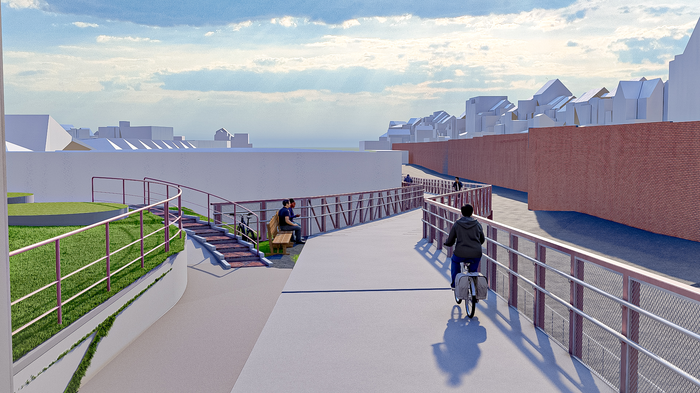
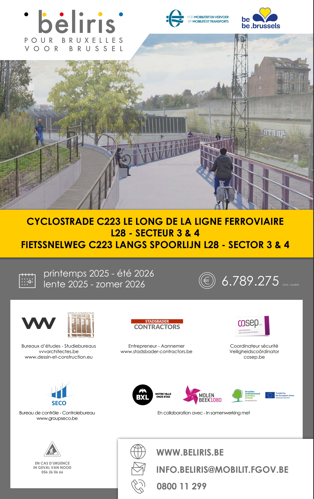

# Guide Pratique : Déploiement de Documentation avec GitHub Actions et MkDocs

Bienvenue dans ce guide pratique, fruit d'une collaboration interactive avec l'IA Gemini. Notre objectif est de vous fournir une ressource claire et concise pour maîtriser le déploiement de votre documentation technique en ligne, en utilisant les puissantes combinaisons de MkDocs et GitHub Actions.

Que vous soyez un développeur débutant ou expérimenté, ce guide vous accompagnera à travers les étapes clés, les défis courants et les solutions éprouvées pour mettre en place un pipeline de documentation efficace et automatisé.

## Au programme :

*   **Comprendre GitHub Actions :** Qu'est-ce que c'est et pourquoi l'utiliser pour votre documentation.
*   **MkDocs :** Configuration de base et personnalisation de votre site.
*   **Déploiement sur GitHub Pages :** Les étapes essentielles et les pièges à éviter.
*   **Résolution de problèmes courants :** Erreurs 404, problèmes de navigation, et autres défis rencontrés.
*   **Astuces avancées :** Améliorer votre workflow de documentation.

Prêt à transformer votre processus de documentation ? Commençons !

<<<<<<<<<<<<<<<<<<<<>>>>>>>>>>>>>>>>>>>>

# VICTORIEN DJONTSO

# **Architecte & Urbanisme / Développeur / BIM & 3D-artiste / digital art **

## RECENTES ACTIVITES MARQUANTES

- **Adresse :**1348, Louvain-la-Neuve
- **Email :** dvrchipro@gmail.com
- **[Site Web](https://dvgt-dev.github.io/DV_Web_page/) | [Github](https://github.com/DvGt-dev/DV_Web_page/tree/main) | [LinkedIn](https://www.linkedin.com/in/djontso-victorien) | [YouTube](https://www.youtube.com/channel/UCdjontso-victorien2171)**

## PROFESSIONAL REFERENCES

- **NOCA N°414** (National Order of Architects of Cameroon)

## SKILLS

- Versatility \ Rigor and precision \ Critical thinking \ Team spirit
- Ability to solve complex problems \ Perseverance in projects \ Intellectual curiosity \ Autonomy in learning
- Artistic Sensibility \ Graphic Design \ Creativity and innovation
- Proficiency in Excel \ Python Programming \ Visual Programming (Grasshopper-Houdini) \ Office Pack

## CERTIFICATES, TRAINING

- **MOOC Bâtiment durable** (ADEME-France, 2018)
  - [Construire en zone tropical humide](https://www.mooc-batiment-durable.fr/fr/formations/lumiere-thermique-et-acoustique-bien-construire-en-zone-tropical/)
- **MOOC BIM: MOOC Bâtiment durable** (ADEME-France, 2018)
  - [Devenez acteur de la transition numérique (But without evaluation)](https://www.mooc-batiment-durable.fr/fr/formations/moocbim-devenez-acteur-de-la-transition-numerique/)

## LANGUAGES

- **French :** Mother tongue
- **English :** Notions

## PROJECTS

- Monument of the Fiftieth Anniversary of the National Unity of Cameroon
- Resort with pool in Kribi

## AREAS OF INTEREST

- Digital/IT Solution in Architecture and Graphic Art
- Creative 3D Art
- Data management in simulation, visualization and Implementation/Construction.

## PROFESSIONAL PROFILE

- Designing Architectural Plans on **Autocad**, 2D and 3D Plans \ **BIM Models Implementation**
- Automatic Publication of Plans \ Enhancement of **BIM** information from the model via external sources (Excel, Python, Grasshopper)
- **Autocad** high-fidelity exchange configuration with **Autodesk** (layers, colors, layer filters, layout templates), Revit (BIM model, BIM to be improved)
- Knowledge of the legal basis (Belgian law, BIM and Subuilt Space and then on the Environment); cartographic software, techniques and resources useful to the urban planner (following the current specialization in urban planning).
- Sufficient basis for the use of programming and AI in my work environment and my applications (member of the **GitHub** developer community); use of AI facilitators (**GitHub**-copilot for code, stable diffusion images); Implementation of local text generation for data management and analysis.
- Ambitions: interactive presentations (virtual and augmented reality), real-time simulation, animations (recent experimentation with Unreal Engine and Houdini)

## CAREER

### ACADEMIC INTERN

- **Desisn Construction \ Charleroi \ Apprentissage contract \ June 2023 - August 2023**
  - 3D models + presentation images, official meetings (Commune, BELRIS, COACTM), presentation documents, field visit / construction site.

### CONSULTANT

- **[ZF Architects](https://www.zf-architects.com/) \ Yaoundé \ Independent \ Mar. 2021 - Sept. 2022**
  - Designer, Architect of Follow-up/Surveys, Presentation etc.

### PROFESSIONAL INTERNSHIP

- **Cabinet Serge Eloundou - SETREC AUI Sarl \ Yaoundé \ Professionnalization contract \ March 2019 - March 2021**
  - Programmer, designer, follow-up architect, presentations etc.
  - Various projects; Large-scale buildings (office building (Ministry), large and complex projects)

### STAGE STAFF

- **Cabinet Bureau d'Etudes Architectes (BEA) \ Bafoussam \ Professionnalization contract \ Aug. 2019 - Dec. 2019**
  - Assistant follow-up Architect, Designer
  - Construction of the cathedral in Bafoussam

### ACADEMIC INTERN

- **URBATHEC Conseil \ Yaoundé \ Apprentissage contract \ July 2016 - Sept. 2016**
  - Architectural design, project on ArchiCAD, 2D and 3D plans.
  - Architect's reference: the magnificent building of the  (Direction Générale des Impôtss) in Yaoundé
  - Supervised by his intern Herman Kante, now an international reference (published in [forbes](https://forbesafrique.com/hermann-kamte-modele-dune-nouvelle-generation-darchitectes/))

## FORMATION

### SPECIALIZED MASTER'S DEGREE

- **Urbanisme et Aménagement du Territoire (URBA2MC)**
  - Université catholique de Louvain (Louvain-la-Neuve) \ September 2022 - Ongoing

### ARCHITECT

- **Architecture et Art de l'Ingénieur (AAI)**
  - Institut des Beaux-arts de Foumban (IBAF) - (UDs) Foumban-Cameroon \ July 2018 \ B+ / Fairy good

### BACHELOR'S DEGREE IN ARCHITECTURE

- **Architecture et Art de l'Ingénieur (AAI)**
  - Institut des Beaux-arts de Foumban (IBAF) - (UDs) Foumban-Cameroon \ September 2016 \ B- / Fairy well

### SCIENTIFIC BACALAUREATE SERIES "C"

- **Mathematics and sciences physiques**
  - Lycée Classique de Bafoussam \ September 2013

### ---------------------------------------------------------------------------------------------
### SOME IMAGE ACHIEVEMENTS

